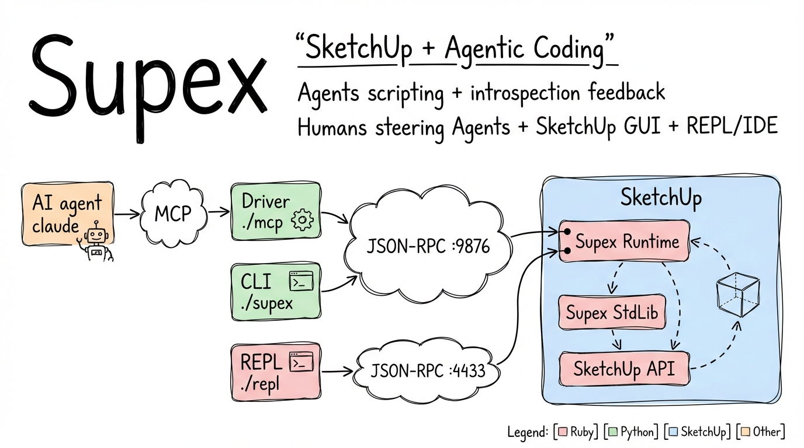

> **Note**: Unless you explicitly switched, you are viewing the `main` branch which contains stable releases. Active development happens on the [`dev` branch](https://github.com/darwin/supex/tree/dev).

# Supex: SketchUp Automation for Agentic Coding

An experimental platform that brings [agentic coding](https://www.claude.com/blog/introduction-to-agentic-coding) to [SketchUp](https://www.sketchup.com). Describe what you want to build in natural language, and let AI write and execute Ruby scripts directly in SketchUp. Designed for programmers who want to augment their 3D modeling workflow with AI assistance and direct API access.

> **Early Stage Project**: Supex is in very early development, tested only on macOS with [Claude Code](https://claude.ai/code) and the latest SketchUp version. Programmers with existing agentic coding experience will get the most out of it.

## Motivation

I'm Antonin, a programmer who discovered the power of agentic coding. Working with Claude Code on git-versioned projects changed how I think about software development - describing intent in natural language, iterating rapidly, and having full history of every change.

When I started a SketchUp project for my house renovation, I wondered if similar workflow could be used. Not to replace direct modeling in SketchUp's GUI - that's still the best way to sketch ideas and make quick adjustments. But for repetitive tasks, parametric designs, and complex geometry, I wanted to describe what I need and let AI figure out the Ruby code.

Supex bridges these two worlds: keep using SketchUp's intuitive interface for direct manipulation, while having AI handle the scripting when you need precision, automation, or just want to say "create a staircase with 15 steps" instead of drawing it manually.

## Contents

- [Key Features](#key-features)
- [Architecture Overview](#architecture-overview)
- [Project-Based Workflow](#project-based-workflow)
- [Installation & Setup](#installation--setup)
- [Quick Start](#quick-start)
- [Development](#development)
- [Reference](#reference)

## Key Features

### Direct Ruby API Access
- **Full SketchUp Ruby API**: Execute any SketchUp operation via Ruby code
- **eval_ruby & eval_ruby_file**: Run code inline or from project scripts
- **Unlimited Flexibility**: No constraints on what you can create or modify

### Model Introspection
- **Entity Inspection**: List and examine faces, edges, groups, components with details
- **Visual Verification**: Take screenshots to verify modeling results
- **Selection & Context**: Inspect currently selected entities
- **Materials & Layers**: Browse materials and layers in the model
- **Camera Information**: Query current view position and settings
- **Model Statistics**: Get comprehensive model state without writing code

### Project-Based Workflow
- **Scripts in Your Repository**: Ruby files live in your project directory structure
- **Version Control Ready**: Full git integration for modeling scripts
- **IDE Support**: Edit scripts with syntax highlighting and RuboCop
- **Modular Organization**: Separate scripts for different features and utilities
- **Export Capabilities**: SKP, OBJ, STL, PNG, JPG formats

## Architecture Overview

Supex bridges AI agents and CLI tools with SketchUp through a client-server architecture:



**Client-Side Components (Python):**

- **Driver** (`./mcp`) - [MCP](https://modelcontextprotocol.io) server for AI agent integration (FastMCP framework)
- **CLI** (`./supex`) - Command-line interface for direct interaction
- **REPL** (`./repl`) - Interactive Ruby console for development

**SketchUp-Side Components (Ruby):**

- **Supex Runtime** - Bridge server accepting JSON-RPC connections on ports 9876 (MCP/CLI) and 4433 (REPL)
- **Supex StdLib** - Helper library for common SketchUp operations
- **SketchUp API** - Native Ruby API for 3D modeling

**Communication**: JSON-RPC 2.0 over TCP sockets (localhost:9876 for MCP/CLI, localhost:4433 for REPL) enables execution of Ruby code directly in SketchUp's context.

For more details, see [Architecture](docs/architecture.md).

## Project-Based Workflow

Supex enables a **project-based workflow** where Ruby scripts live in your git-versioned project directories, treating 3D modeling code like application code:

```
your-project/
├── src/
│   ├── create_table.rb    # Create base geometry
│   ├── add_details.rb     # Add decorative elements
│   └── materials.rb       # Apply materials
├── models/
│   └── project.skp
└── .mcp.json              # Claude Code configuration
```

### Development Cycle

```bash
# 1. Launch SketchUp with Supex extension
cd /path/to/supex
./scripts/launch-sketchup.sh

# 2. Execute scripts (use absolute paths)
./supex eval-file /path/to/your-project/src/create_table.rb

# 3. Verify results
./supex info
./supex screenshot

# 4. Iterate - edit script and re-run
```

For AI-driven development, Claude Code handles paths automatically via MCP tools.

### Benefits

- **Version Control**: Modeling code tracked in git
- **IDE Integration**: Syntax highlighting, autocomplete, linting
- **Team Collaboration**: Multiple people can work on scripts
- **Code Reusability**: Share scripts across projects
- **Proper Errors**: Line numbers and stack traces point to actual files

### AI-Driven Development

This workflow is ideal for Claude Code:

1. **AI writes Ruby scripts** (in your git-versioned project)
2. **AI executes scripts** using `eval_ruby_file` tool via MCP
3. **AI verifies results** using introspection tools via MCP:
    - `get_model_info()` - Entity counts and state
    - `take_screenshot()` - Visual verification
    - `list_entities()` - Geometry inspection
4. **AI iterates** based on verification feedback

## Installation & Setup

### Requirements

- **SketchUp 2026** - Download from [sketchup.com](https://www.sketchup.com)
    - Only the latest SketchUp version is tested
    - Project is experimental - no backward compatibility guarantees
- **Claude Code** - AI-powered development environment from [claude.ai/code](https://claude.ai/code)
    - Only tested with Claude Code (experimental project)
    - Other MCP-compatible AI agents might work but are untested
- **macOS** - Currently the primary supported platform
- **Python 3.14+** - For the MCP driver (managed via UV)
- **Ruby 3.2.2** - Same as the Ruby version bundled with SketchUp 2026


### 1. Clone the Repository

```bash
git clone https://github.com/darwin/supex.git
cd supex
```

### 2. Launch SketchUp with Extension

The development launcher handles extension deployment automatically:

```bash
./scripts/launch-sketchup.sh path/to/your/model.skp
```

This script:
- Detects SketchUp 2026 installation
- Deploys Ruby extension sources directly (no .rbz building required)
- Enables live reloading during development
- Optionally opens a model given as parameter  

### 3. Configure Claude Code

Add Supex MCP server to your project:

```bash
claude mcp add supex -- /path/to/supex/mcp
```

Replace `/path/to/supex/mcp` with the actual path to your Supex installation.

### 4. Verify Connection

```bash
./supex status
```

You should see connection status and SketchUp version information.

## Quick Start

For a complete step-by-step tutorial, see the **[Simple Table Example](https://github.com/darwin/supex/tree/example-simple-table)**.

Example projects live in separate orphan branches. To clone an example:

```bash
git clone -b example-simple-table https://github.com/darwin/supex.git simple-table
cd simple-table
```

The example covers:
1. Project setup and configuration
2. Creating geometry with Ruby scripts
3. Using introspection tools to verify results
4. Iterative development workflow

## Development

Run tests and linters from the repository root:

```bash
# Run all unit tests (driver, stdlib, runtime)
./scripts/launch-tests.sh

# Run all tests including E2E (requires SketchUp running)
./scripts/launch-tests.sh --e2e

# Run all linters (RuboCop, ruff, mypy)
./scripts/lint.sh
```

If you have [mise](https://mise.jdx.dev/) installed:

```bash
mise run test       # Unit tests
mise run test:e2e   # All tests including E2E
mise run lint       # All linters
```

## Reference

- **[CLI Reference](docs/cli.md)** - Command-line interface for direct SketchUp interaction
- **[Interactive REPL](docs/repl.md)** - Interactive Ruby development in SketchUp
- **[MCP Reference](docs/mcp.md)** - Tools available for AI agents (Claude Code)
- **[Configuration](docs/configuration.md)** - Environment variables and settings
- **[Protocol](docs/protocol.md)** - JSON-RPC communication protocol details
- **[Security](docs/security.md)** - Authentication, path restrictions, and recommendations
- **[Troubleshooting](docs/troubleshooting.md)** - Common issues and solutions
