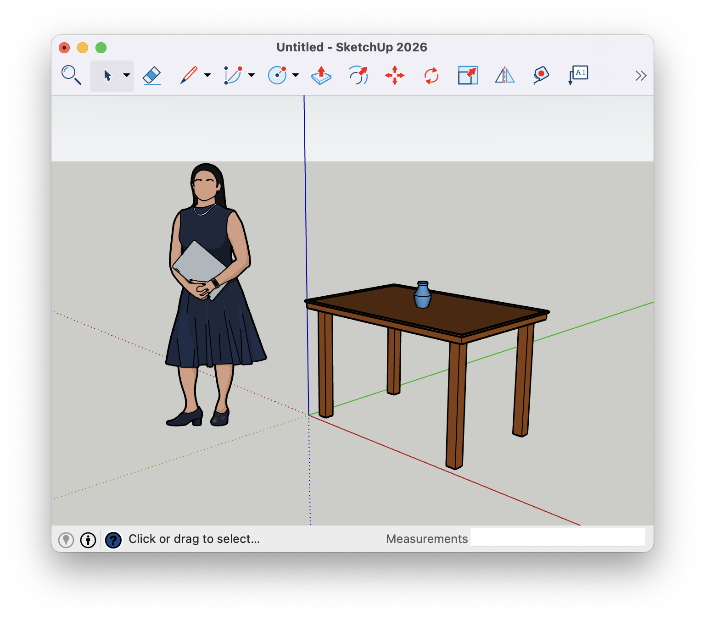

# Simple Table Example - Complete Tutorial

This example provides a complete step-by-step introduction to [Supex](https://github.com/darwin/supex), showing you how to create 3D models in [SketchUp](https://www.sketchup.com) using Ruby scripts and AI coding agents ([Claude Code](https://claude.ai/code), [Gemini CLI](https://github.com/google-gemini/gemini-cli), or [Codex CLI](https://github.com/openai/codex)).



## What You'll Learn

By the end of this tutorial, you'll know how to:
- Set up Supex with SketchUp and your AI agent
- Write and execute Ruby scripts to create 3D geometry
- Use introspection tools to verify your models
- Save and iterate on your designs
- Try parametric VCAD geometry in the playground
- Start your own SketchUp automation projects

## Prerequisites

Before starting, make sure you have:

### 1. SketchUp 2026

Download from [sketchup.com](https://www.sketchup.com) if you haven't already.

**Verify installation:**
- Can you launch SketchUp?
- Is it version 2026? (Check SketchUp → About SketchUp)
- Note: Only the latest SketchUp is tested (project is experimental)

### 2. AI Coding Agent

You need one of these [MCP](https://modelcontextprotocol.io)-compatible AI agents:

**Claude Code** - Download from [claude.ai/code](https://claude.ai/code)
- Verify: `claude --version`

**Gemini CLI** - Install from [github.com/google-gemini/gemini-cli](https://github.com/google-gemini/gemini-cli)
- Verify: `gemini --version`

**Codex CLI** - Install from [github.com/openai/codex](https://github.com/openai/codex)
- Verify: `codex --version`

### 3. Supex Checkout

Clone Supex with its submodules (the VCAD part of this tutorial needs them):

```bash
git clone --recurse-submodules https://github.com/darwin/supex.git
```

**Verify you have Supex:**
```bash
ls /path/to/supex/mcp  # Should show the mcp wrapper script
```

Throughout this tutorial, replace `/path/to/supex` with the actual path to your Supex checkout.

### 4. Ruby Environment (Optional)

This project pins Ruby 3.2.2 in `.ruby-version` to match the interpreter bundled with SketchUp 2026. You only need a local Ruby to run RuboCop on the scripts (`just lint`); SketchUp runs the scripts with its own Ruby. Any version manager that reads `.ruby-version` (rbenv, mise, chruby) will pick the right version:

```bash
bundle install
just lint
```

## Step 1: Launch SketchUp with the Supex Extension

The development launcher loads the extension directly from the Supex sources (no `.rbz` building required):

```bash
cd /path/to/supex
./scripts/launch-sketchup.sh
```

This will:
- Validate the extension sources
- Launch SketchUp with the Supex extension loaded
- Start the bridge server on `127.0.0.1:9876`

**Verify the extension loaded:**
1. SketchUp should launch
2. Open the Ruby Console (Window → Ruby Console)
3. You should see `Supex: Bridge server started on 127.0.0.1:9876`

If you see any errors, check the [Troubleshooting](#troubleshooting) section below.

## Step 2: Link the Supex Agent Guide

`AGENTS.md` (the instructions your agent reads) points to `supex-guide/` for the Supex workflow rules, MCP tool reference, stdlib and SketchUp API docs. The guide lives in the Supex checkout, so link it into the project:

```bash
# From the project directory
ln -s /path/to/supex/docs/agents/guide supex-guide
```

The symlink is listed in `.gitignore` because the path differs per developer. `CLAUDE.md` and `GEMINI.md` are symlinks to `AGENTS.md`, so all three agents read the same instructions; Codex CLI reads `AGENTS.md` natively.

**Verify:** `ls supex-guide/README.md` should print the path.

## Step 3: Configure Your AI Agent

This project supports **Claude Code**, **Gemini CLI**, and **Codex CLI**. Configure whichever you prefer. All of them start the MCP server automatically - you don't need to run anything manually.

Supex needs to know your project directory: it is the **workspace** that relative file paths (`src/create_table.rb`, `model.skp`) resolve against and where logs and screenshots land (`.tmp/`). Pass it as the `SUPEX_WORKSPACE` environment variable. If the variable is missing, the `mcp` wrapper falls back to the directory the agent started the server in, which is normally the project directory.

### Claude Code

Register the server in the project scope. This writes `.mcp.json` into the project directory (listed in `.gitignore`):

```bash
claude mcp add --scope project --transport stdio supex \
  -e SUPEX_WORKSPACE="$(pwd)" \
  -- /path/to/supex/mcp
```

Equivalent `.mcp.json`:

```json
{
  "mcpServers": {
    "supex": {
      "type": "stdio",
      "command": "/path/to/supex/mcp",
      "env": { "SUPEX_WORKSPACE": "/path/to/example-simple-table" }
    }
  }
}
```

Claude Code asks you to approve project-scoped servers the first time you open the project.

### Gemini CLI

```bash
gemini mcp add supex /path/to/supex/mcp \
  --scope user \
  --transport stdio \
  -e SUPEX_WORKSPACE="$(pwd)"
```

### Codex CLI

```bash
codex mcp add supex \
  --env SUPEX_WORKSPACE="$(pwd)" \
  -- /path/to/supex/mcp
```

### Optional: Supex CLI

The `supex` CLI lets you talk to SketchUp from the shell without an agent. It uses `~/.supex/tmp-workspace` as its workspace unless you tell it otherwise, so pass the project directory explicitly:

```bash
SUPEX_WORKSPACE="$(pwd)" /path/to/supex/supex status
```

The `supex` symlink name is listed in `.gitignore` if you prefer `ln -s /path/to/supex/supex supex`.

### Verify Configuration

1. Open your AI agent in this project directory
2. Ask it to call `check_status`
3. The response should show the SketchUp connection as connected (the VCAD sidecar and viewer may be reported as not running yet; that is fine until Step 7)

## Step 4: Create Your First Model

Now you're ready to create your first 3D model! Let's build a simple table.

### Understanding the Project Structure

```
example-simple-table/
├── AGENTS.md                # Shared AI agent instructions
├── CLAUDE.md                # Symlink to AGENTS.md (Claude Code)
├── GEMINI.md                # Symlink to AGENTS.md (Gemini CLI)
├── README.md                # This file
├── .ruby-version            # Ruby 3.2.2 (matches SketchUp 2026)
├── Gemfile                  # Ruby dependencies (RuboCop, API stubs)
├── justfile                 # `just lint`
├── supex-guide/             # Symlink to supex/docs/agents/guide (create it, Step 2)
├── src/
│   ├── helpers.rb           # Module definition, constants, cleanup utilities
│   ├── sketchup_extensions.rb  # Chainable .move_to / .rotate on Group
│   ├── create_table.rb      # Table creation (top + legs)
│   ├── add_decorations.rb   # Decorative trim for the table edges
│   └── add_vase.rb          # Ceramic vase (Follow Me revolution)
└── playground/
    └── examples/            # VCAD parametric parts (*.cmp.oo)
```

### Load and Run the Table Script

The scripts define the `SupexSimpleTable` module. Each script loads its own dependencies via `require_relative`, so loading `create_table.rb` also pulls in `helpers.rb` and `sketchup_extensions.rb`.

In your AI agent, ask:

```
Load src/create_table.rb and call SupexSimpleTable.example_table
```

The agent will use the Supex tools directly:

```ruby
eval_ruby_file('src/create_table.rb')   # relative to the project root (workspace)
SupexSimpleTable.example_table          # via eval_ruby
```

**What happens:**
1. Your AI agent sends the commands to the MCP server
2. The MCP server forwards them to SketchUp
3. SketchUp executes the `example_table` orchestration method
4. A table with 4 legs appears in your model!

**Note:** The example methods are **idempotent** - you can run them multiple times and they'll replace the previous table instead of creating duplicates.

### Verify the Results

Check what was created using introspection tools:

```
get_model_info()
```

This returns the model title, units and entity counts (faces, edges, groups, component instances).

Take a screenshot to see the visual result:

```
take_screenshot()
```

This saves a screenshot to `.tmp/screenshots/` in the project and returns the file path.

**Note**: The tool returns just the file path (saves tokens). Only read the screenshot if you need to see it.

### Inspect the Geometry

See what groups were created at the root of the model:

```
list_entities('groups')
```

The response contains a `count` and an `entities` list with the type, entity ID, name and layer of each group. You will see a single root group named `Table`; the top and the legs are nested inside it. For a tree view, `get_entity_tree()` shows the nesting.

## Step 5: Add Details

Now let's add decorative trim and a vase.

### Execute the Decorations Script

```ruby
eval_ruby_file('src/add_decorations.rb')
SupexSimpleTable.example_decorations
```

This will:
1. Find the existing table in your model
2. Add decorative trim around the table edges
3. Apply a gold material to the trim
4. Use a boolean union to create clean geometry

### Execute the Vase Script

```ruby
eval_ruby_file('src/add_vase.rb')
SupexSimpleTable.example_vase
```

The vase profile is revolved with SketchUp's Follow Me and placed on the table top.

### All at Once

`example_full` loads all scripts and creates the table, trim and vase in one call:

```ruby
eval_ruby_file('src/create_table.rb')
SupexSimpleTable.example_full
```

### Verify the Changes

```
get_model_info()
```

The trim and the vase are nested inside the `Table` group, so you'll still see one group at the root level.

## Step 6: Save Your Model

Save the model into this project directory:

```
save_model('model.skp')
```

Relative paths resolve against the workspace, so the file lands next to `README.md`. Now you have a SketchUp file you can open and modify anytime!

## Step 7: Try VCAD (Optional)

Supex can also build geometry with VCAD, a parametric BRep kernel driven by Loon code. `playground/examples/` contains a few `.cmp.oo` parts (a plate, a bracket, a vent, a hub and a mascot). This needs the VCAD sidecar built once in your Supex checkout:

```bash
cd /path/to/supex
./scripts/rebuild.sh sidecar
```

Then ask your agent:

```
Place playground/examples/bracket.cmp.oo in the model with vcad_place
```

The agent evaluates the Loon source in the sidecar and imports the resulting mesh as a component. Edit the `.cmp.oo` file and call `vcad_update` (or let the file watcher do it) to see the change. Rules and the constructor reference are in `supex-guide/vcad.md`.

## Understanding the Code

Let's look at how the modular architecture works.

### Modular Architecture

The scripts use a **procedural programming** approach organized into a module:

```ruby
module SupexSimpleTable
  # Low-level: Create individual components
  def self.create_table_top(parent_entities, length, width, height, thickness, material)
    # Creates the top surface
  end

  # Mid-level: Create groups of components
  def self.create_table_legs(parent_entities, table_length, table_width, leg_size, leg_inset, ...)
    # Creates all 4 legs from a shared component definition
  end

  # High-level: Assemble complete objects
  def self.create_simple_table(entities, params = {})
    # Assembles the complete table with defaults
  end

  # Orchestration: Transaction management and metadata
  def self.example_table(params = {})
    # Wraps in an operation, handles cleanup, adds metadata, returns the group
  end
end
```

### Function Levels

**Low-level functions** create individual geometry:
- `create_table_top` - Creates the top surface
- `find_or_create_leg_definition` - Creates (or reuses) the leg component definition

**Mid-level functions** create collections:
- `create_table_legs` - Places all 4 legs as instances of the leg definition

**High-level functions** assemble complete objects:
- `create_simple_table` - Combines top + legs into a table
- Accepts an optional `params` hash with defaults
- Returns clean geometry without metadata

**Orchestration functions** manage transactions:
- `example_table` - Wraps in an operation, handles idempotence
- Adds name and attributes to created objects
- Provides error handling and returns the created group

### Hash Parameters with Defaults

High-level functions use hash parameters for flexibility:

```ruby
# Use defaults
table = SupexSimpleTable.create_simple_table(entities)

# Override specific dimensions
table = SupexSimpleTable.create_simple_table(entities,
  table_length: 2.0.m,
  table_width: 1.5.m,
  table_height: 0.8.m
)
```

### Idempotence Pattern

Example methods can be run multiple times safely. Each feature has an identifier constant in `helpers.rb` (`IDENT_TABLE`, `IDENT_DECORATIONS`, `IDENT_VASE`) that is stored as an attribute on the created group, so cleanup only removes geometry this script created:

```ruby
def self.example_table(params = {})
  model = Sketchup.active_model
  entities = model.entities
  table_name = 'Table'

  model.start_operation('Create Simple Table', true)
  begin
    # 1. Cleanup previous instances (by name, verified by attribute)
    cleanup_by_name_and_attribute(entities, table_name, ATTR_DICT, ATTR_KEY, IDENT_TABLE)

    # 2. Create fresh geometry
    table = create_simple_table(entities, params)

    # 3. Apply metadata
    table.name = table_name
    table.set_attribute(ATTR_DICT, ATTR_KEY, IDENT_TABLE)

    model.commit_operation
    table
  rescue
    model.abort_operation
    raise
  end
end
```

Materials follow the same pattern: `create_wood_material(model, tag = IDENT_TABLE)` recreates the material tagged with the identifier instead of piling up copies.

### Key Concepts

**Metric Units:**
- Use `.cm`, `.m`, `.mm` for readable dimensions
- Example: `120.cm` = 120 centimeters

**Groups and Components:**
- Organize geometry into named groups
- The four legs are instances of one component definition, so editing one leg updates all of them

**Operations:**
- `start_operation` / `commit_operation` enable undo/redo
- Always wrap modeling code in operations
- Use `abort_operation` if something fails

**Materials:**
```ruby
material = model.materials.add("Wood")
material.color = [139, 69, 19]  # RGB values
table_top.material = material
```

## Modifying the Example

Try making changes to learn more!

### Change Dimensions

Pass custom dimensions to the orchestration method:

```ruby
SupexSimpleTable.example_table(
  table_length: 2.0.m,
  table_width: 1.5.m,
  table_height: 0.85.m,
  top_thickness: 0.05.m,
  leg_size: 0.08.m
)
```

`verify_table` and `describe_table` check the result:

```ruby
table = Sketchup.active_model.entities.find { |e| e.is_a?(Sketchup::Group) && e.name == 'Table' }
SupexSimpleTable.describe_table(table)
```

### Change Colors

Modify the material function in `create_table.rb`:

```ruby
def self.create_wood_material(model, tag = IDENT_TABLE)
  # Change the color here
  recreate_material(model, 'Wood', Sketchup::Color.new(101, 67, 33), tag)  # Darker brown
end
```

Or create a new material function:

```ruby
def self.create_mahogany_material(model, tag = IDENT_TABLE)
  recreate_material(model, 'Mahogany', Sketchup::Color.new(192, 64, 0), tag)
end
```

After editing a script, load it again with `eval_ruby_file` and re-run the example method.

### Add More Geometry

Create new functions following the same pattern. `create_box` in `helpers.rb` does the face + pushpull work for you:

```ruby
# Add to src/create_table.rb
def self.create_drawer(parent_entities, x, y, width, depth, height)
  drawer = parent_entities.add_group
  drawer.name = 'Drawer'
  create_box(drawer.entities, x, y, 0, x + width, y + depth, height)
  drawer
end

# Use it
drawer = SupexSimpleTable.create_drawer(entities, 0.3.m, 0.2.m, 0.4.m, 0.3.m, 0.15.m)
```

## Troubleshooting

### Extension Not Loading

**Symptom**: SketchUp launches but no `Supex: Bridge server started` message in the Ruby Console

**Solutions:**
1. Check the Ruby Console for errors (Window → Ruby Console)
2. Verify you're using `./scripts/launch-sketchup.sh` from the Supex repository root
3. Check file permissions on the `runtime/` directory

### MCP Connection Failed

**Symptom**: Your AI agent can't find Supex tools

**Solutions:**
1. Verify your MCP server is configured (`claude mcp list` for Claude Code, `gemini mcp list` for Gemini CLI, `codex mcp list` for Codex CLI)
2. Check that the command path in the config is absolute (not relative)
3. Make sure SketchUp is running with the extension
4. Check `.tmp/logs/mcp-stderr.log` and `.tmp/logs/mcp-protocol.jsonl` in the project for error messages

### Script Execution Fails

**Symptom**: `eval_ruby_file` returns an error

**Solutions:**
1. Check the Ruby Console in SketchUp for the detailed error
2. Verify the script file path is correct
3. Look for syntax errors in the Ruby code (`just lint`)
4. Make sure a SketchUp model is active (not the welcome screen)

### Socket Connection Refused

**Symptom**: "Connection refused" error when executing commands

**Solutions:**
1. Verify SketchUp is running
2. Check the extension is loaded (Ruby Console should show `Supex: Bridge server started on 127.0.0.1:9876`)
3. Verify port 9876 isn't used by another application:
   ```bash
   lsof -i :9876
   ```
4. Try restarting SketchUp

### Can't Find Files

**Symptom**: "File not found" or "Path access denied" when using `eval_ruby_file`

**Solutions:**
1. Relative paths resolve against the workspace: make sure `SUPEX_WORKSPACE` in your MCP config points to this project (Step 3)
2. Or use absolute paths: `/full/path/to/script.rb`
3. Paths outside the workspace are rejected by the path policy; see `supex-guide/troubleshooting.md`

## Next Steps

Now that you've completed this tutorial, you can:

### 1. Create Your Own Project

```bash
mkdir my-sketchup-project
cd my-sketchup-project

# Project structure
mkdir src
cp /path/to/example-simple-table/.ruby-version .
cp /path/to/example-simple-table/.gitignore .
cp /path/to/example-simple-table/src/helpers.rb src/

# Agent guide and MCP server (see Steps 2 and 3)
ln -s /path/to/supex/docs/agents/guide supex-guide
claude mcp add --scope project --transport stdio supex -e SUPEX_WORKSPACE="$(pwd)" -- /path/to/supex/mcp

# Agent instructions
cat > AGENTS.md << 'EOF'
# AGENTS.md

For modeling guidance, workflow rules, and tool reference see `supex-guide/` (start with `supex-guide/README.md`).
EOF
ln -s AGENTS.md CLAUDE.md

# Your first script
cat > src/my_model.rb << 'EOF'
# frozen_string_literal: true

require_relative 'helpers'

module SupexMyProject
  def self.example_model
    model = Sketchup.active_model
    entities = model.entities

    model.start_operation('Create Model', true)
    begin
      # Your modeling code here

      model.commit_operation
    rescue
      model.abort_operation
      raise
    end
  end
end

# Call it: SupexMyProject.example_model
EOF
```

Rename the module in `helpers.rb` to match your project.

### 2. Learn More About SketchUp Ruby API

- `supex-guide/api/` - SketchUp API reference bundled with the guide
- [SketchUp Ruby API Documentation](https://ruby.sketchup.com)
- [SketchUp Developer Center](https://developer.sketchup.com)

### 3. Explore the Supex Guide

- `supex-guide/README.md` - Agent conventions and workflow rules
- `supex-guide/mcp.md` - Complete MCP tool inventory
- `supex-guide/workflow.md` - Extended examples and visual QA with batch screenshots
- `supex-guide/ruby.md` - Ruby workflow rules, geometry lessons and pitfalls
- `supex-guide/stdlib/` - Ruby helpers for geometry, materials and inspection
- `supex-guide/vcad.md` - VCAD workflow rules and constructor reference

### 4. Get Help

- **Issues**: Report bugs on the [Supex GitHub repository](https://github.com/darwin/supex/issues)
- **Documentation**: Check the main [Supex README](https://github.com/darwin/supex)

## Key Takeaways

- **Modular architecture**: Code organized in reusable modules with clear function levels
- **Procedural programming**: Functions broken down by responsibility (low/mid/high/orchestration)
- **Hash parameters**: Flexible APIs with sensible defaults (`params = {}`)
- **Idempotence**: Example methods can run multiple times safely
- **Project-based workflow**: Ruby scripts live in your project directory
- **Git-trackable**: All your modeling code is version controlled
- **Iterative**: Edit scripts and re-run to see changes
- **Introspection**: Use tools like `get_model_info()` and `take_screenshot()` to verify
- **Parametric option**: VCAD parts in `playground/` for precise CAD geometry
- **Learning platform**: Generated code teaches you SketchUp Ruby API patterns

Happy modeling with Supex!
